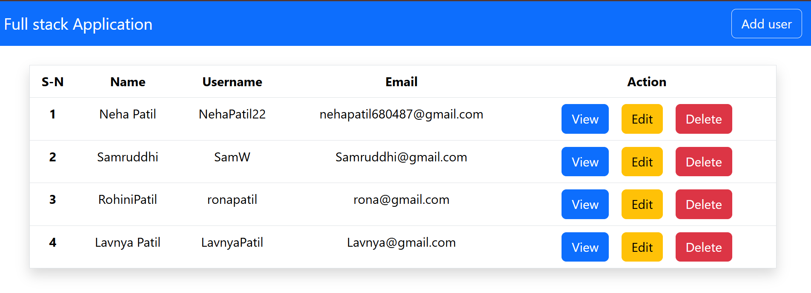
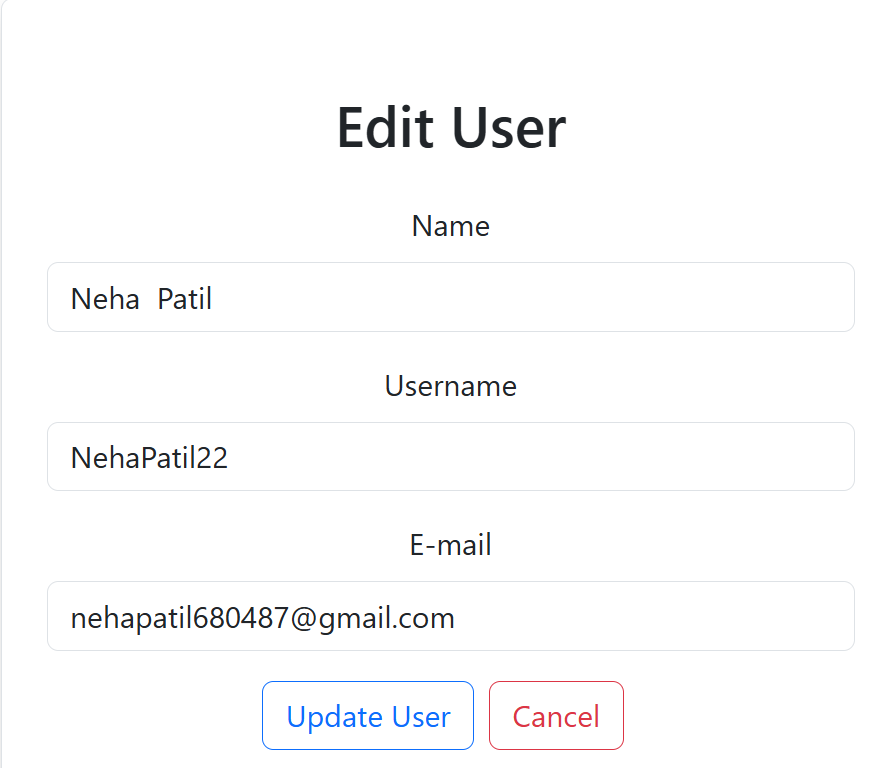
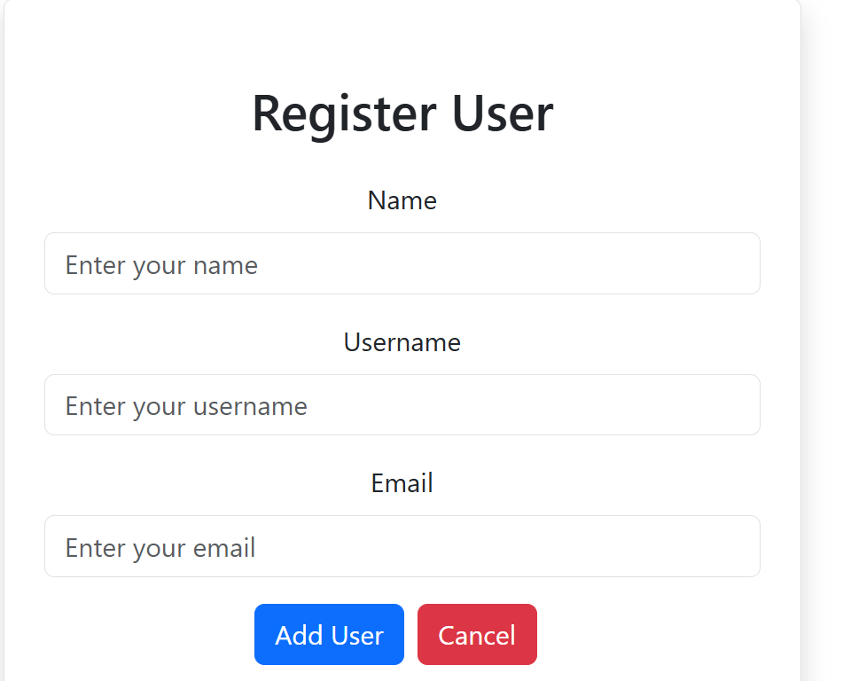
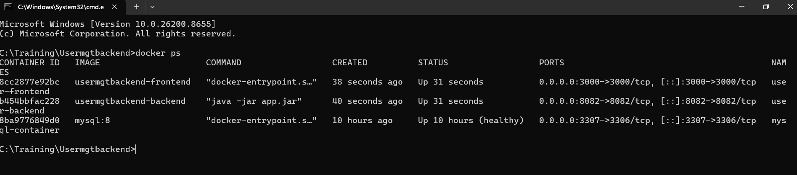

#  User Management System

A Full-Stack User Management System built using **Spring Boot**, **React.js**, **MySQL**, **Docker**, and **Docker Compose**. This application provides complete CRUD (Create, Read, Update, Delete) functionality for managing users through a responsive and user-friendly web interface.

---

##  Project Overview

The User Management System allows users to:

- Create new user records
- View all users
- View user details
- Update existing users
- Delete users
- Store data in MySQL Database
- Access the application through a modern React UI
- Run the complete application using Docker containers

---

## 🛠️ Tech Stack

### Backend
- Java 17
- Spring Boot
- Spring Data JPA
- Hibernate
- Maven
- REST APIs

### Frontend
- React.js
- Axios
- React Router DOM
- Bootstrap

### Database
- MySQL

### DevOps & Tools
- Docker
- Docker Compose
- Git
- GitHub

---

##  Features

✅ Add New User

✅ View All Users

✅ View User Details

✅ Update User Information

✅ Delete User

✅ RESTful API Integration

✅ MySQL Database Connectivity

✅ Dockerized Application

✅ Multi-Container Deployment with Docker Compose

✅ Responsive User Interface

---

##  Application Architecture

```text
+---------------------+
|   React Frontend    |
|     Port: 3000      |
+----------+----------+
           |
           ▼
+---------------------+
| Spring Boot Backend |
|     Port: 8082      |
+----------+----------+
           |
           ▼
+---------------------+
|   MySQL Database    |
|     Port: 3306      |
+---------------------+
```

---

##  Project Structure

```text
UserManagementSystem/
│
├── user_mgt_frontend/
│   ├── src/
│   ├── public/
│   ├── package.json
│   └── Dockerfile
│
├── Usermanagementbackend/
│   ├── src/
│   ├── pom.xml
│   └── Dockerfile
│
├── screenshots/
│   ├── home.png
│   ├── register.png
│   ├── update.png
│   └── docker.png
│
├── docker-compose.yml
└── README.md
```

---

## 🌐 Application URLs

| Service | URL |
|----------|------|
| Frontend | http://localhost:3000 |
| Backend API | http://localhost:8082 |
| MySQL Database | localhost:3306 |

---

## ⚙️ Running the Application Locally

### 1️⃣ Clone Repository

```bash
git clone https://github.com/nehapatil680487-cell/UserManagementSystem.git

### 2️⃣ Run Backend

```bash
cd Usermanagementbackend
mvn spring-boot:run
```

Backend runs on:

```text
http://localhost:8082
```

### 3️⃣ Run Frontend

```bash
cd user_mgt_frontend
npm install
npm start
```

Frontend runs on:

```text
http://localhost:3000
```

---

## 🐳 Running with Docker

### Build and Start Containers

```bash
docker-compose up --build
```

### Stop Containers

```bash
docker-compose down
```

### View Running Containers

```bash
docker ps
```

---

## 🔗 REST API Endpoints

| Method | Endpoint | Description |
|----------|------------|-------------|
| GET | /users | Get All Users |
| GET | /user/{id} | Get User By ID |
| POST | /user | Add New User |
| PUT | /user/{id} | Update User |
| DELETE | /user/{id} | Delete User |

---

## 📸 Project Screenshots

### 🏠 Home Page



---

### ➕ Add User Page



---

### ✏️ Update User Page



---

### 🐳 Docker Containers Running



---

## 🎯 Learning Outcomes

This project helped in understanding:

- Full-Stack Application Development
- Spring Boot REST API Development
- React Frontend Integration
- MySQL Database Operations
- Docker Containerization
- Docker Compose Orchestration
- Git & GitHub Version Control
- CRUD Application Design

---

## 🔮 Future Enhancements

- JWT Authentication & Authorization
- Search & Filter Users
- Pagination
- Role-Based Access Control
- Email Notifications
- Cloud Deployment (AWS/Azure)


---

<div align="center">

### 🚀 Built with Spring Boot, React, MySQL & Docker

</div>
